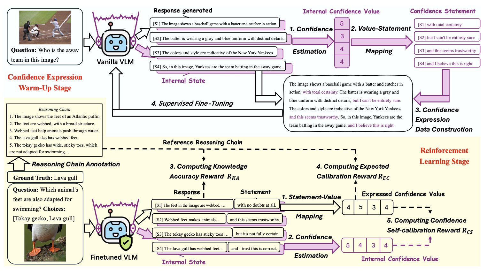
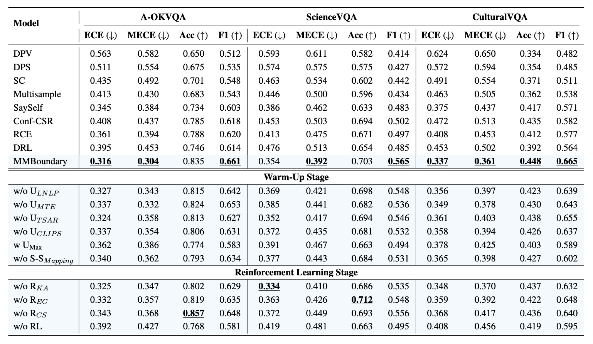
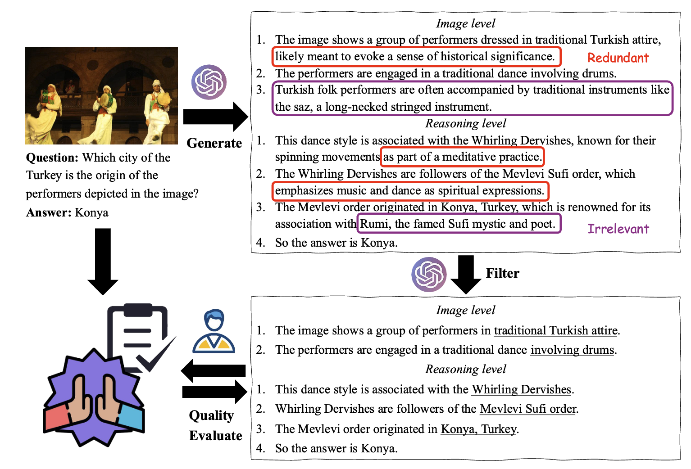

<div align="center">

# MMBoundary: Advancing MLLM Knowledge Boundary Awareness through Reasoning Step Confidence Calibration

</div>

<div align="center">
<b><a href="https://scholar.google.com/citations?user=ULvoYXgAAAAJ&hl=zh-CN" target="_blank">Zhitao He</a><sup>1</sup> <a href="https://github.com/Zhitao-He/MMBoundary" target="_blank"> Sandeep Polisetty </a><sup>2</sup> <a href="https://zhiyuan.fan/" target="_blank">Zhiyuan Fan</a><sup>1</sup> <a href="https://lukahhcm.github.io/" target="_blank"> Yuchen Huang </a><sup>1</sup> <a href="https://shujinwu-0814.github.io/" target="_blank"> Shujin Wu </a><sup>3</sup> <a href="https://mayrfung.github.io/" target="_blank">Yi R. (May) Fung</a><sup>1</sup></b>


<sup>1 </sup>HKUST &nbsp; <sup>2 </sup> UMass Amherst &nbsp; <sup>3 </sup>USC

[](https://arxiv.org/abs/xxx)
[](https://huggingface.co/datasets/Sterzhang/xxx)

</div>

<br>

## News

- **2025/05/15:** 🔥 **MMBoundary** is accepted to ACL 2025 Main Conference!

---


## Introduction

In recent years, multimodal large language models (MLLMs) have made significant progress but continue to face inherent challenges in multimodal reasoning, which requires multi-level ( e.g.,  perception, reasoning) and multi-granular (e.g., multi-step reasoning chain) advanced inferencing. Prior work on estimating model confidence tends to focus on the overall response for training and calibration, but fails to assess confidence in each reasoning step, leading to undesirable hallucination snowballing. In this work, we present MMBoundary, a novel framework that advances the knowledge boundary awareness of MLLMs through reasoning step confidence calibration. To achieve this, we propose to incorporate complementary textual and cross-modal self-rewarding signals to estimate confidence at each step of the MLLM reasoning process. In addition to supervised fine-tuning MLLM on this set of self-rewarded confidence estimation signal for initial confidence expression warm-up, we introduce a reinforcement learning stage with multiple reward functions for further aligning model knowledge and calibrating confidence at each reasoning step, enhancing reasoning chain self-correction. Empirical results show that MMBoundary significantly outperforms existing methods across diverse domain datasets and metrics, achieving an average of 7.5% reduction in multimodal confidence calibration errors and up to 8.3% improvement in task performance.

---

<div align="center">
<h3>MMBoundary Overview</h3>

</div>

The overview of **MMBoundary**, which consists of two stages. The initial stage trains MLLMs via supervised learning to generate natural language confidence statement for each sentence, similar to human expression. The second stage employs reinforcement learning with three intuitively designed reward functions to further calibrate the expressed confidence estimates and enhance knowledge alignment. <span style="color:#800080">■</span> represents the internal states (i.e., the log probability of tokens) of model and the estimated internal confidence.

<div align="center">
<h3>Experimental Results</h3>

</div>

The evaluation results of models and various ablations of our framework. CulturalVQA is the out-of-distribution dataset. **w/o U<sub>LNLP</sub>**, **w/o U<sub>MTE</sub>**, **w/o U<sub>TSAR</sub>**, and **w/o U<sub>CLIPS</sub>** represent MMBoundary without the three text-based uncertainty estimation methods and visual information uncertainty estimation, respectively; **w U<sub>Max</sub>** indicates the confidence determined using the max pooling method from the four uncertainty estimation scores; **w/o S-S<sub>Mapping</sub>** denotes MMBoundary without confidence score-statement mapping; **w/o R<sub>KA</sub>**, **w/o R<sub>EC</sub>**, and **w/o R<sub>CS</sub>** represent MMBoundary without knowledge accuracy reward, expected calibration reward, and confidence self-calibration reward, respectively; **w/o RL** denotes MMBoundary without reinforcement learning.

---

## Environment setup

- **Git clone:**

```bash
git clone https://github.com/Zhitao-He/MMBoundary.git
cd MMBoundary
```

- **Create a conda environment:**

```bash
conda create -n MMBoundary python=3.10
conda activate MMBoundary
pip install -r requirements.txt
```

## Downloading the dataset

- **A-OKVQA:**

```bash
export AOKVQA_DIR=./datasets/aokvqa/
mkdir -p ${AOKVQA_DIR}

curl -fsSL https://prior-datasets.s3.us-east-2.amazonaws.com/aokvqa/aokvqa_v1p0.tar.gz | tar xvz -C ${AOKVQA_DIR}

```

```bash
export COCO_DIR=./datasets/coco/
mkdir -p ${COCO_DIR}

for split in train val test; do
    wget "http://images.cocodataset.org/zips/${split}2017.zip"
    unzip "${split}2017.zip" -d ${COCO_DIR}; rm "${split}2017.zip"
done

wget http://images.cocodataset.org/annotations/annotations_trainval2017.zip
unzip annotations_trainval2017.zip -d ${COCO_DIR}; rm annotations_trainval2017.zip
```

- **ScienceVQA:**

```bash
git clone https://github.com/lupantech/ScienceQA.git

. tools/download.sh
```

- **CulturalVQA:**

Download the CulturalVQA dataset from [huggingface repository](https://huggingface.co/datasets/mair-lab/CulturalVQA/tree/main/data) link. To load and use the CulturalVQA benchmark, use the following commands:

```bash
from datasets import load_dataset

culturalvqa_dataset = load_dataset(‘./CulturalVQA')
```

## Our annotated data

We first prompt GPT-4o to generate an analysis (reasoning chain) structured at the perception and reasoning levels. Then, we have GPT-4o filter and correct the initially annotated chains. Finally, manual data quality control is conducted to ensure accuracy and reliability.

<div align="center">
<h3> The Annotation Pipeline. </h3>

</div>


We provide the annotated data and the script. In the file of annotated data, you will see the following structure:

```bash
annotated_data/
├── aokvqa
│   ├── train_mmb
│   ├── val_mmb
├── sciencevqa
│   ├── train_mmb
│   ├── val_mmb
├── culturalvqa
│   ├── cvqa_mmb
```

your can also download from our [huggingface repository](https://huggingface.co/datasets/Zhitao-He/MMBoundary) link.

## Annotate data script

- **AOKVQA** 

```bash
python code/annotate_data/construct_dataset_aokvqa.py
```

- **ScicenceVQA**

```bash
python code/annotate_data/construct_dataset_sciencevqa.py
```

- **CulturalVQA**

```bash
python code/annotate_data/construct_dataset_culturalvqa.py
```

## Uncertainty estimation

In the file of uncertainty, you will see the following structure:

```bash
uncertainty/
├── normalized_logprob.py
├── token_SAR.py
├── mean_token_entropy.py
├── clip_score.py
```

run following script to get the normalized confidence score of model: 

```bash
python code/uncertainty/vlm_uncertainty.py
```

```bash
python code/uncertainty/uncertainty_normalize.py
```

## Construct data and training

run following script to construct fine-tuning data:

```bash
python code/training/training_data_construct.py
```

The preset statement is in  [code/training/confidence_statement.json](code/training/confidence_statement.json)

We use the [LLaMA-Factory](https://github.com/hiyouga/LLaMA-Factory) framework for Supervised Fine-Tuning (SFT). Run the following script:

```bash
python code/training/training_sft_model.yaml
```

Run the following script for Reinforcement Learning (RL):

```bash
python code/training/training_rl_model.py
```

## Evaluation

Download [Cross-Encoder](https://www.sbert.net/examples/applications/cross-encoder/README.html) model. Pre-trained models can be used like this:

```bash
from sentence_transformers import CrossEncoder
model = CrossEncoder('model_name')
scores = model.predict([('Sentence 1', 'Sentence 2'), ('Sentence 3', 'Sentence 4')])
```

run following script to evaluate:

```bash
python code/evaluation/eval.py
```

## Citation

```bibtex
@misc{he2025mmboundary,
      title={MMBoundary: Advancing MLLM Knowledge Boundary Awareness through Reasoning Step Confidence Calibration}, 
      author={Zhitao He and Sandeep Polisetty and Zhiyuan Fan and Yuchen Huang and Shijin Wu and Yi R. Fung},
      year={2025},
      eprint={2502.xxx},
      archivePrefix={arXiv},
      primaryClass={cs.CL},
      url={https://arxiv.org/abs/2502.xxx}, 
}
```

## License

**Code:** Licensed under the [Apache 2.0 License](LICENSE).
 **Dataset:** Licensed under the [CC BY-NC 4.0 License](https://creativecommons.org/licenses/by-nc/4.0/).
 
## Acknowledgments  
We would like to thank the following open-source projects for their contributions:  [LLaMA-Factory](https://github.com/hiyouga/LLaMA-Factory), [lm-polygraph](https://github.com/IINemo/lm-polygraph).

